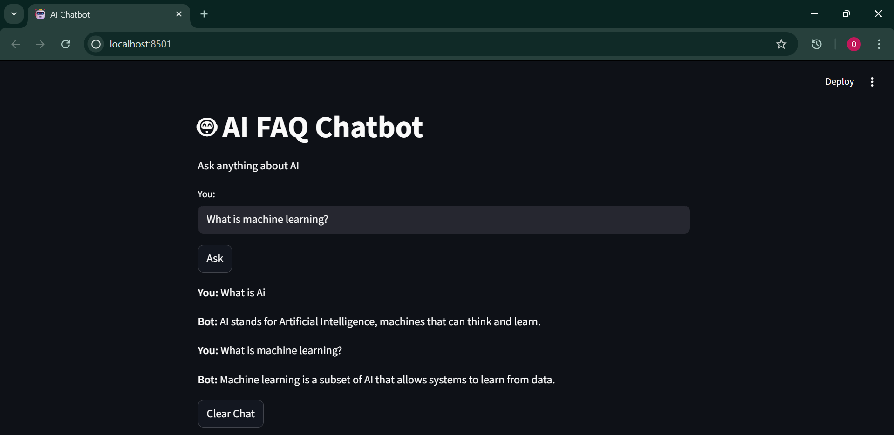
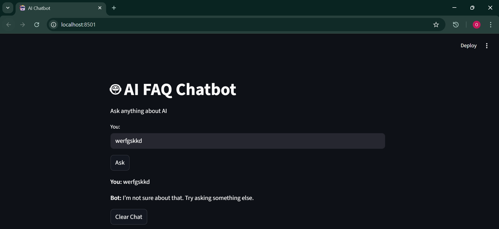
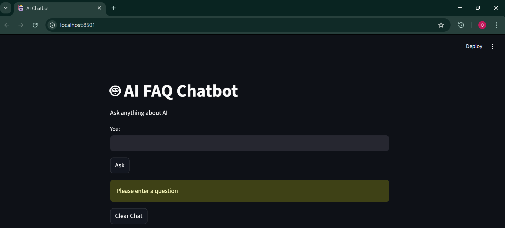

# 🤖 AI FAQ Chatbot

An AI-powered chatbot that answers questions by matching user input with the most relevant FAQ using Natural Language Processing.

## 🚀 Features
- Ask questions in natural language
- Finds the most relevant answer using AI
- Simple and clean chat interface
- Handles unknown questions gracefully

## 🧠 How It Works
- Converts text into numerical vectors using TF-IDF
- Measures similarity using cosine similarity
- Returns the most relevant answer

## 🛠 Tech Stack
- Python
- Streamlit
- Scikit-learn (TF-IDF, Cosine Similarity)

## 📸 Preview





## ▶️ How to Run

```bash
pip install -r requirements.txt
streamlit run chatbot_app.py
