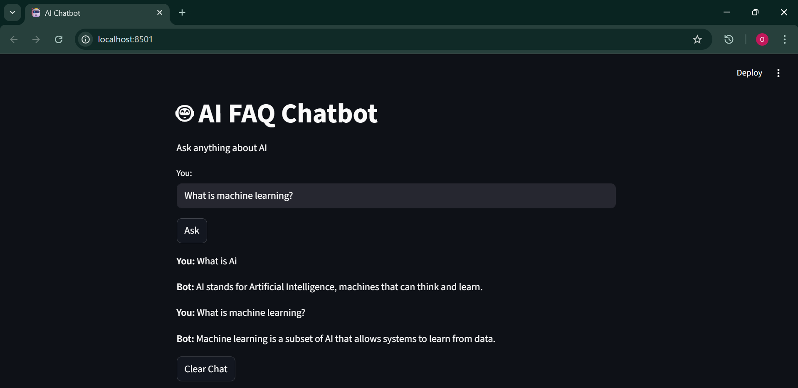
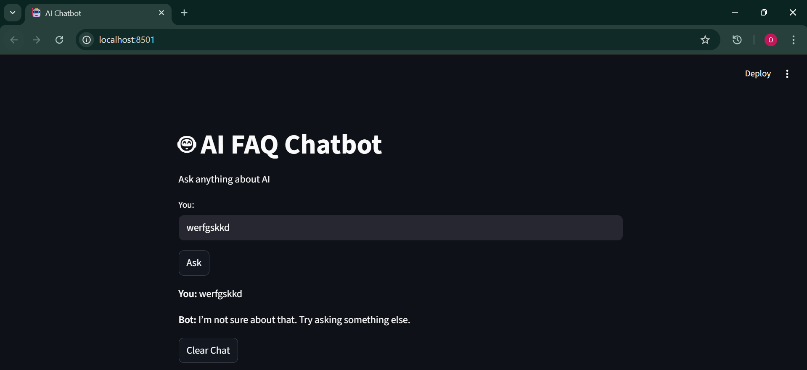
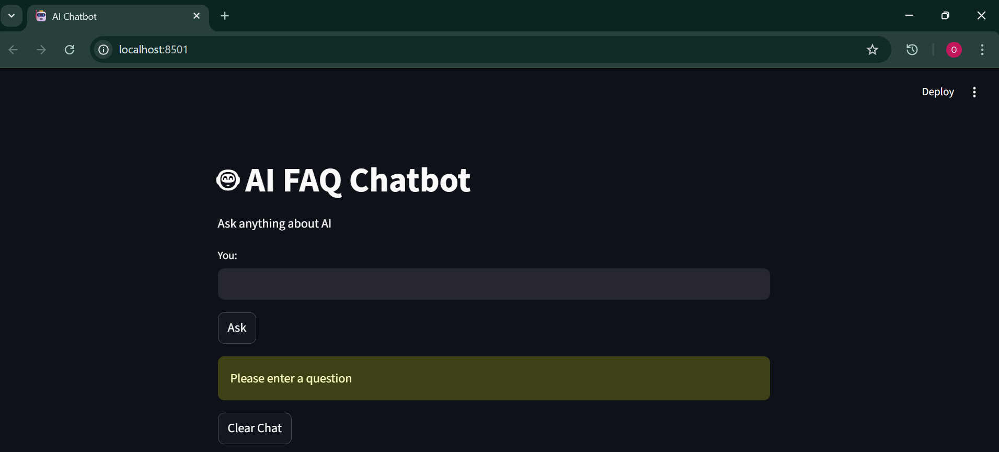

# 🤖 AI FAQ Chatbot

An AI-powered chatbot that answers questions by matching user input with the most relevant FAQ using Natural Language Processing.

___
## 🚀 Features
- Ask questions in natural language
- Finds the most relevant answer using AI
- Simple and clean chat interface
- Handles unknown questions gracefully
___
## 🧠 How It Works
- Converts text into numerical vectors using TF-IDF
- Measures similarity using cosine similarity
- Returns the most relevant answer
___
## 🛠 Tech Stack
- Python
- Streamlit
- Scikit-learn (TF-IDF, Cosine Similarity)
___
## 📸 Preview




___
## ▶️ How to Run


1. Clone the repository

```bash
git clone https://github.com/samueladebisi-dev/ai-faq-chatbot.git
```

2. Navigate into the project folder

```bash
cd ai-faq-chatbot
```

3. Create and activate a virtual environment

### Windows
```bash
python -m venv venv
venv\Scripts\activate
```

### Mac/Linux
```bash
python3 -m venv venv
source venv/bin/activate
```

4. Install dependencies

```bash
pip install -r requirements.txt
```

5. Run the application

```bash
python -m streamlit run chatbot_app.py
```